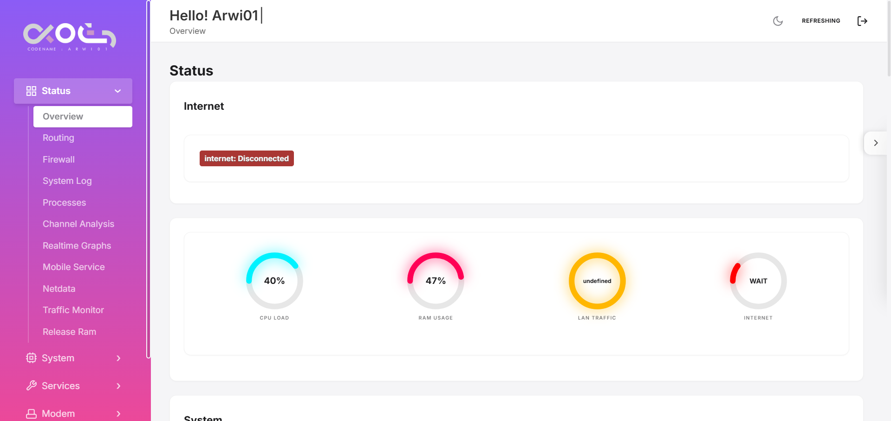
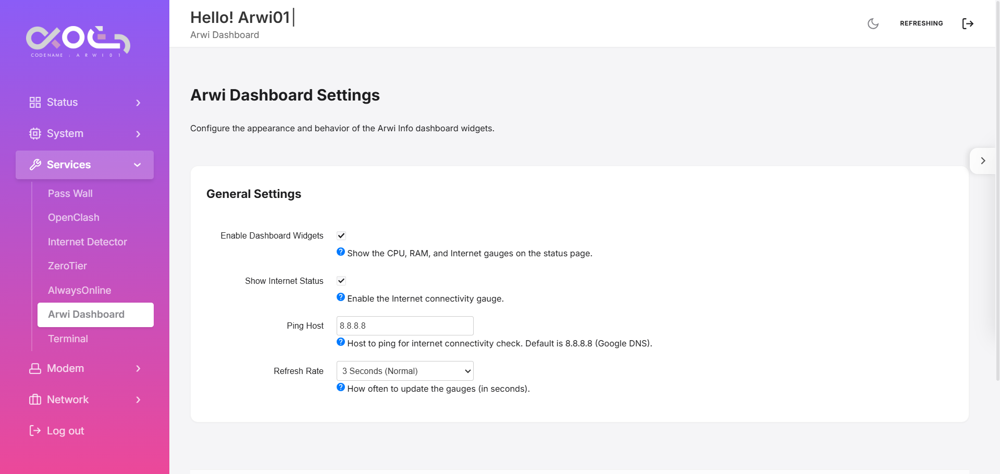

# Arwi Dashboard

<div align="center">
  
  
  <p><strong>Real-time System Monitoring Dashboard for OpenWrt LuCI</strong></p>
  
  [](LICENSE)
  [](https://openwrt.org)
  [](https://github.com/openwrt/luci)
</div>

---

## 📊 Overview

**Arwi Dashboard** adalah aplikasi LuCI untuk OpenWrt yang menyediakan monitoring sistem secara real-time dengan tampilan gauge yang modern dan interaktif. Dashboard ini menampilkan informasi penting seperti CPU load, penggunaan RAM, traffic jaringan LAN, dan status koneksi internet.

## ✨ Features

- 🎯 **Real-time Monitoring**
  - CPU Load dengan update otomatis
  - RAM Usage tracking
  - LAN Traffic monitoring (RX/TX)
  - Internet connectivity status

- 🎨 **Modern UI/UX**
  - Circular gauge dengan efek neon glow
  - Responsive design untuk mobile dan desktop
  - Smooth animations dan transitions
  - Dark mode friendly

- ⚙️ **Customizable Settings**
  - Konfigurasi ping host untuk internet check
  - Adjustable refresh rate (1s, 3s, 5s)
  - Toggle untuk enable/disable widgets
  - Toggle untuk show/hide internet status

- 🔒 **Secure & Lightweight**
  - Minimal dependencies (hanya `+luci-base`)
  - Proper ACL permissions
  - Efficient resource usage

## 📸 Screenshots

### Dashboard View


### Configuration Panel


## 🚀 Installation

### Method 1: Build from Source (Recommended)

1. Clone repository ini ke dalam OpenWrt SDK atau Buildroot:
```bash
cd ~/openwrt/package
git clone https://github.com/derisamedia/luci-app-arwi-dashboard.git
```

2. Update feeds:
```bash
cd ~/openwrt
./scripts/feeds update -a
./scripts/feeds install -a
```

3. Configure package:
```bash
make menuconfig
# Navigate to: LuCI -> Applications -> luci-app-arwi-dashboard
# Press 'M' to select as module
```

4. Build the package:
```bash
make package/luci-app-arwi-dashboard/compile V=s
```

5. IPK file akan tersedia di:
```
bin/packages/<architecture>/base/luci-app-arwi-dashboard_*.ipk
```

### Method 2: Install Pre-built IPK

1. Download IPK file dari [Releases](https://github.com/derisamedia/luci-app-arwi-dashboard/releases)

2. Upload ke router OpenWrt Anda

3. Install via SSH:
```bash
opkg update
opkg install luci-app-arwi-dashboard_*.ipk
```

4. Restart LuCI:
```bash
/etc/init.d/uhttpd restart
```

## 📋 Requirements

- OpenWrt 24.xx atau lebih baru
- LuCI web interface
- Minimal 2MB free storage space

## 🔧 Configuration

Setelah instalasi, akses konfigurasi melalui:

**LuCI → Services → Arwi Dashboard**

### Available Options:

| Option | Description | Default |
|--------|-------------|---------|
| Enable Dashboard Widgets | Show/hide all gauges | Enabled |
| Show Internet Status | Display internet connectivity gauge | Enabled |
| Ping Host | Host untuk internet connectivity check | 8.8.8.8 |
| Refresh Rate | Update interval untuk gauges | 3 seconds |

## 📁 File Structure

```
luci-app-arwi-dashboard/
├── Makefile                          # OpenWrt package definition
├── README.md                         # This file
├── Arwi_Dashboard.png               # Logo
├── htdocs/
│   └── luci-static/
│       └── resources/
│           └── view/
│               ├── arwi_dashboard/
│               │   └── config.js    # Configuration page
│               └── status/
│                   └── include/
│                       └── 05_arwi_gauges.js  # Main dashboard widget
└── root/
    ├── etc/
    │   └── config/
    │       └── arwi_dashboard            # Default UCI config
    └── usr/
        └── share/
            ├── luci/
            │   └── menu.d/
            │       └── luci-app-arwi-dashboard.json  # Menu entry
            └── rpcd/
                └── acl.d/
                    └── luci-app-arwi-dashboard.json  # ACL permissions
```

## 🛠️ Development

### Prerequisites

- OpenWrt SDK atau full buildroot
- Basic knowledge of LuCI framework
- JavaScript (ES6+)

### Local Development

1. Clone repository:
```bash
git clone https://github.com/derisamedia/luci-app-arwi-dashboard.git
cd luci-app-arwi-dashboard
```

2. Make your changes

3. Test on OpenWrt device:
```bash
# Copy files directly to router for testing
scp -r htdocs/* root@192.168.1.1:/www/
scp -r root/* root@192.168.1.1:/
```

4. Restart LuCI:
```bash
ssh root@192.168.1.1 "/etc/init.d/uhttpd restart"
```

## 🤝 Contributing

Contributions are welcome! Please feel free to submit a Pull Request.

1. Fork the project
2. Create your feature branch (`git checkout -b feature/AmazingFeature`)
3. Commit your changes (`git commit -m 'Add some AmazingFeature'`)
4. Push to the branch (`git push origin feature/AmazingFeature`)
5. Open a Pull Request

## 📝 License

This project is licensed under the Apache License 2.0 - see the [LICENSE](LICENSE) file for details.

## 👤 Author

**Derisamedia**

- GitHub: [@derisamedia](https://github.com/derisamedia)

## 🙏 Acknowledgments

- OpenWrt Project
- LuCI Development Team
- All contributors and users
- IndoWrt Community
- DBAI Community

## 📞 Support

If you encounter any issues or have questions:

- 🐛 [Report a Bug](https://github.com/derisamedia/luci-app-arwi-dashboard/issues)
- 💡 [Request a Feature](https://github.com/derisamedia/luci-app-arwi-dashboard/issues)
- 📧 Contact: yuimizuno86@gmail.com

---

<div align="center">
  Made with ❤️ for the OpenWrt Community
</div>
